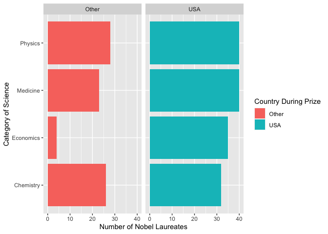

Lab 03 - Nobel laureates
================
Heather Hawkins
01/23/23

### Load packages and data

``` r
library(tidyverse) 
```

``` r
nobel <- read_csv("data/nobel.csv")
```

## Exercises

### Exercise 1

``` r
nobel <- read_csv("data/nobel.csv")
dim(nobel)
```

    ## [1] 935  26

``` r
#to specify columns and rows
```

26 variables and 935 observations, each observation is a Noble Laureate

### Exercise 2

``` r
nobel_living <- nobel %>%
  filter(!is.na(country), gender!="org",is.na(died_date),)

dim(nobel_living)
```

    ## [1] 228  26

Got it! ☺️

``` r
living_during_prize <- nobel_living %>%
  mutate(
    living_during_prize = if_else(country == "USA", "USA", "Other")
  )
```

``` r
nobel_living_science <- living_during_prize %>%
  filter(category %in% c("Physics", "Medicine", "Chemistry", "Economics"))

dim(nobel_living)
```

    ## [1] 228  26

### Exercise 3

``` r
ggplot(nobel_living_science, aes(x = category, fill = living_during_prize)) +
  geom_bar(position = "stack") +
  coord_flip() + facet_wrap(~living_during_prize)+ labs (x= "Category of Science", y= "Number of Nobel Laureates" ) + labs(fill="Country During Prize") 
```

<!-- -->

### Exercise 4

…

### Exercise 5

…

### Exercise 6

…
