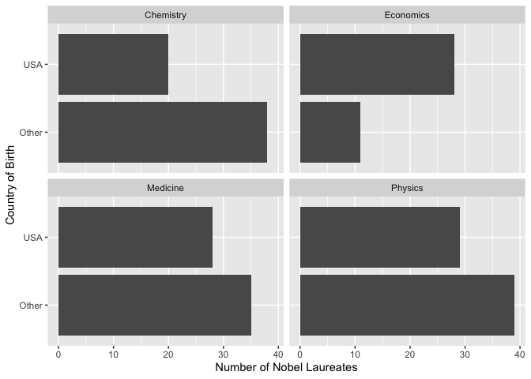

Lab 03 - Nobel laureates
================
Heather Hawkins
01/23/23

### Load packages and data

``` r
library(tidyverse) 
```

``` r
nobel <- read_csv("data/nobel.csv")
```

## Exercises

### Exercise 1

``` r
nobel <- read_csv("data/nobel.csv")
dim(nobel)
```

    ## [1] 935  26

``` r
#to specify columns and rows
```

26 variables and 935 observations, each observation is a Noble Laureate

### Exercise 2

``` r
nobel_living <- nobel %>%
  filter(!is.na(country), gender!="org",is.na(died_date),)

dim(nobel_living)
```

    ## [1] 228  26

Got it! ☺️

``` r
living_during_prize <- nobel_living %>%
  mutate(
    living_during_prize = if_else(country == "USA", "USA", "Other")
  )
```

``` r
nobel_living_science <- living_during_prize %>%
  filter(category %in% c("Physics", "Medicine", "Chemistry", "Economics"))

dim(nobel_living)
```

    ## [1] 228  26

### Exercise 3

``` r
nobel_living_science_graph <- nobel_living_science %>%
  group_by(category,living_during_prize) %>%
  summarize(country_count = table(living_during_prize))
```

    ## `summarise()` has grouped output by 'category'. You can override using the
    ## `.groups` argument.

``` r
ggplot(nobel_living_science_graph, mapping = aes(x= country_count, y = living_during_prize))+
  geom_bar(position = "dodge", stat = "identity")+ facet_wrap(~category)+ labs (x= "Number of Nobel Laureates", y= "Living When Recieving Prize") 
```

    ## Don't know how to automatically pick scale for object of type <table>.
    ## Defaulting to continuous.

<!-- -->

### Exercise 4

``` r
nobel_living_science_born <- nobel_living_science %>%
  mutate(
    born_country_us = if_else(born_country == "USA", "USA", "Other")
  )
```

``` r
ggplot(nobel_living_science_born, aes(x = born_country_us)) +
  geom_bar(position = "stack") +
  coord_flip() + facet_wrap(~category)+ labs (x= "Country of Birth", y= "Number of Nobel Laureates" ) + labs(fill="Category of Science") 
```

<!-- -->

``` r
nobel_living_science_born %>%
  group_by(born_country_us) %>% 
  dplyr::count(born_country_us)
```

    ## # A tibble: 2 × 2
    ## # Groups:   born_country_us [2]
    ##   born_country_us     n
    ##   <chr>           <int>
    ## 1 Other             123
    ## 2 USA               105

It seems as if 105 winners were born in the USA graphBorn_Country \<-
nobel_living_science_born %\>%
group_by(category,living_during_prize,born_country_us) %\>%
summarize(country_count=table(nobel_living_science_born))

### Exercise 5

``` r
ggplot(nobel_living_science_born, aes(x = living_during_prize, fill= born_country_us)) +
  geom_bar(position = "stack") +
  coord_flip() + facet_wrap(~category)+ labs (x= "Living During Award", y= "Number of Nobel Laureates" ) + labs(fill="Place of Birth") 
```

<!-- --> Although most
U.S. based Laureates were born in the US for the sciences, there is a
significant amount of U.S Lauretes that were born in other countries.
Because of this, I do believe this data supports Buzzfeed’s claim. \###
Exercise 6

…
